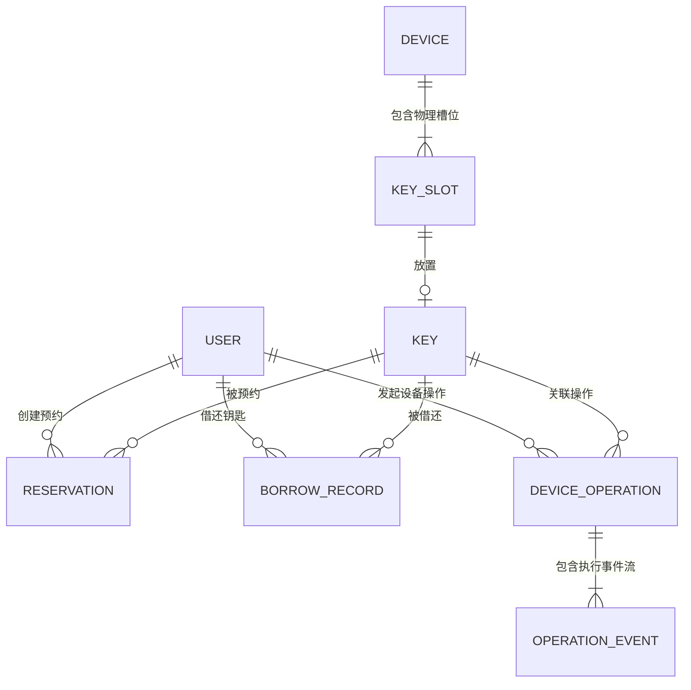

# 智能钥匙自助借还系统：领域数据模型规范 (Data Model V1)

> 文档版本：V1.0  
> 状态：正式冻结 (Frozen)  
> 适用范围：微信小程序、业务后台 (Spring Boot / Node.js / Go)、数据库设计

---

## 1. 概念模型关系图 (ER Diagram)



---

## 2. 实体详细定义

### 2.1 用户实体 (User)

```typescript
export interface User {
  id: string;              // 用户唯一 ID (如 "U001")
  name: string;            // 用户姓名 (如 "张三")
  studentNo: string;       // 学号/工号 (如 "20230001") - 使用 studentNo 而非 studentId
  role: 'USER' | 'ADMIN';  // 角色 (MAINTAINER 保留给 v0.5)
  status: 'ACTIVE' | 'DISABLED'; // 状态 (DISABLED 表示账号已停用)
  department: string;      // 所属学院/部门 (如 "信息科学与工程学院")
  phone?: string;          // 联系电话 (如 "13800138000")
  avatarUrl?: string;      // 头像链接
  creditScore: number;     // 信用评分 (默认 100)
  createdAt: string;       // 注册时间 (ISO8601)
  updatedAt: string;       // 更新时间 (ISO8601)
}
```

### 2.2 钥匙实体 (Key)

```typescript
export interface Key {
  id: string;              // 钥匙唯一标识 (如 "KEY103")
  name: string;            // 钥匙名称 (如 "103 实验室钥匙")
  roomNo: string;          // 房间号 (如 "103")
  building: string;        // 所在楼宇 (如 "信息楼")
  description?: string;    // 房间说明/用途 (如 "主要用于人工智能与嵌入式课题实验")
  deviceId: string;        // 所属钥匙柜 ID (如 "CAB001")
  slotId: string;          // 当前关联物理槽位 ID (如 "SLOT03")
  rfidTag: string;         // 绑定 RFID 芯片 UID (如 "E200001A9903")
  status: 'AVAILABLE' | 'RESERVED' | 'BORROWED' | 'MAINTENANCE' | 'DISABLED'; // 业务状态 (注: OVERDUE 从 BorrowRecord 派生，不作为 Key 状态)
  enabled: boolean;        // 是否在用启用 (true: 在用, false: 停用)
  requiresApproval: boolean; // 是否需要管理员审批 (默认 false)
  createdAt: string;
  updatedAt: string;
}
```

### 2.3 物理槽位实体 (KeySlot)

```typescript
export interface KeySlot {
  id: string;              // 槽位全局 ID (如 "SLOT03")
  deviceId: string;        // 所属钥匙柜 ID (如 "CAB001")
  slotNo: number;          // 柜内物理序号 (1 ~ 10)
  keyId?: string;          // 当前存放钥匙 ID (空槽为 null/undefined)
  presence: 'PRESENT' | 'ABSENT' | 'UNKNOWN' | 'FAULT'; // 传感器在位检测 (PRESENT: 在位, ABSENT: 离柜, UNKNOWN: 无法确认, FAULT: 传感器异常)
  enabled: boolean;        // 槽位机械是否正常可用 (true: 正常, false: 故障禁用)
  updatedAt: string;
}
```

### 2.4 钥匙柜设备实体 (Device)

```typescript
export interface Device {
  id: string;              // 钥匙柜唯一 ID (如 "CAB001")
  name: string;            // 柜体显示名称 (如 "1号钥匙柜 (信息楼一楼大厅)")
  location: string;        // 物理位置描述 (如 "信息楼 1F 门厅东侧")
  status: 'ONLINE' | 'OFFLINE' | 'BUSY' | 'FAULT' | 'MAINTENANCE'; // 柜体连接与运行状态 (FAULT: 当前存在故障, MAINTENANCE: 人为进入维护状态)
  totalSlots: number;      // 总槽位数 (如 10)
  availableSlots: number;  // 当前在位可用钥匙数
  ipAddress?: string;      // 柜机网络 IP
  lastHeartbeatAt: string; // 最近心跳时间戳 (ISO8601)
  updatedAt: string;
}
```

### 2.5 预约实体 (Reservation)

```typescript
export interface Reservation {
  id: string;              // 预约单号 (如 "RES202609020001")
  userId: string;          // 预约用户 ID
  userName: string;        // 用户姓名
  keyId: string;           // 预约钥匙 ID
  keyName: string;         // 钥匙名称
  roomNo: string;          // 房间号
  deviceId: string;        // 取钥钥匙柜 ID
  status: 'PENDING' | 'APPROVED' | 'ACTIVE' | 'USED' | 'REJECTED' | 'CANCELLED' | 'EXPIRED';
  // PENDING: 待审批
  // APPROVED: 审批通过但取钥窗口尚未开始
  // ACTIVE: 处于可取钥有效窗口内
  // USED: 已履约完成（已成功取钥）
  // REJECTED: 审批拒绝
  // CANCELLED: 用户主动取消
  // EXPIRED: 超期未取钥自动过期
  purpose: string;         // 借用用途说明 (如 "深度学习模型训练与课程实验")
  pickupWindowStart: string; // 取钥有效窗口开始时间 (ISO8601)
  pickupWindowEnd: string;   // 取钥有效窗口截止时间 (ISO8601)
  expectedReturnAt: string;  // 预计归还时间 (ISO8601)
  createdAt: string;
  approvedAt?: string;     // 审批通过时间
  usedAt?: string;         // 实际取钥时间
  cancelledAt?: string;    // 取消时间
  updatedAt: string;
}
```

### 2.6 借还记录实体 (BorrowRecord)

```typescript
export interface BorrowRecord {
  id: string;              // 借还台账单号 (如 "BOR202609020001")
  reservationId?: string;  // 关联预约单号 (V1 阶段必填，V2 支持现场直借时可为空)
  userId: string;          // 借用人用户 ID
  userName: string;        // 借用人姓名
  keyId: string;           // 钥匙 ID
  keyName: string;         // 钥匙名称
  roomNo: string;          // 房间号
  deviceId: string;        // 借出钥匙柜 ID
  slotId: string;          // 关联槽位 ID
  returnDeviceId?: string; // 归还钥匙柜 ID (支持异柜归还预留)
  status: 'BORROWING' | 'BORROWED' | 'RETURNING' | 'COMPLETED' | 'EXCEPTION';
  // BORROWING: 取钥出柜中（设备正在执行操作）
  // BORROWED: 已借出（钥匙已被用户取走，处于借用期）
  // RETURNING: 归还入柜中（设备正在执行归还检测操作）
  // COMPLETED: 已完成归还
  // EXCEPTION: 异常状态（如还错钥匙、设备卡死等）
  // 注意: OVERDUE 从主状态机分离，通过派生逻辑计算
  borrowedAt?: number;     // 实际借出/取走时间戳 (ISO8601)
  expectedReturnAt: string; // 应归还时间戳 (ISO8601)
  overdueAt?: string;      // 逾期触发时间戳（若发生逾期，记录首次逾期时间）
  returnedAt?: string;     // 实际归还完成时间戳 (ISO8601)
  purpose?: string;        // 借用用途
  notes?: string;          // 备注或异常说明 (如 "逾期 2 小时归还")
  createdAt: string;
  updatedAt: string;
}

/**
 * 派生逻辑约定：
 * - isOverdue: status === 'BORROWED' && now > expectedReturnAt
 * - wasOverdue: status === 'COMPLETED' && overdueAt != null
 * - 前端显示: wasOverdue ? "逾期归还" : "按时归还"
 */
```

### 2.7 设备操作事务实体 (DeviceOperation)

```typescript
export interface DeviceOperation {
  id: string;              // 操作会话单号 (如 "OP20260902120001")
  requestId: string;       // 一次操作对应的防重请求ID
  action: 'PICKUP' | 'RETURN'; // 操作动作类型 (取钥 / 归还)
  deviceId: string;        // 执行设备 ID (如 "CAB001")
  userId: string;          // 发起用户 ID
  keyId: string;           // 操作目标钥匙 ID
  slotId: string;          // 关联槽位 ID
  reservationId?: string;  // 关联预约单号 (取钥时必填)
  borrowRecordId?: string; // 关联借还记录单号 (归还时必填)
  status: 'CREATED' | 'AUTHORIZED' | 'SENT' | 'EXECUTING' | 'SUCCESS' | 'FAILED' | 'TIMEOUT' | 'CANCELLED';
  // CREATED: 已创建
  // AUTHORIZED: 身份/预约验证通过，已授权
  // SENT: 已向设备发送控制指令
  // EXECUTING: 设备正在执行机械动作（定位/开门/等待）
  // SUCCESS: 操作成功完成
  // FAILED: 操作失败
  // TIMEOUT: 操作超时
  // CANCELLED: 操作被取消
  errorCode?: string;      // 失败或异常错误码 (参考 07-ERROR-CODES.md)
  errorMessage?: string;   // 友好中文失败提示
  createdAt: string;       // 创建时间戳
  startedAt?: string;      // 开始执行时间戳
  finishedAt?: string;     // 完成时间戳
  updatedAt: string;
}

export interface OperationEvent {
  seq: number;             // 事件流水序号 (自增 1, 2, 3...)
  timestamp: string;       // 事件发生时间 (ISO8601)
  type: string;            // 事件类型枚举 (POSITIONING, POSITIONED, DOOR_OPEN, KEY_REMOVED, RFID_CONFIRMED, HOMING, SUCCESS, FAILED...)
  payload?: Record<string, any>; // 附加参数
}

/**
 * 设计说明：
 * - DeviceOperation.status: 表示操作的生命周期状态
 * - OperationEvent.type: 表示设备硬件当前执行的具体步骤/事件
 * - 前端通过 status 判断操作是否完成，通过 events 流展示实时进度
 */
```

---

## 3. 数据库表结构规划 (SQL DDL 参考)

```sql
-- 钥匙表
CREATE TABLE `t_key` (
  `id` VARCHAR(32) NOT NULL PRIMARY KEY COMMENT '钥匙ID',
  `name` VARCHAR(64) NOT NULL COMMENT '钥匙名称',
  `room_no` VARCHAR(32) NOT NULL COMMENT '房间号',
  `building` VARCHAR(64) NOT NULL DEFAULT '信息楼' COMMENT '楼宇',
  `description` VARCHAR(255) COMMENT '说明',
  `device_id` VARCHAR(32) NOT NULL COMMENT '所属钥匙柜ID',
  `slot_id` VARCHAR(32) NOT NULL COMMENT '当前物理槽位ID',
  `rfid_tag` VARCHAR(64) NOT NULL COMMENT '绑定的RFID UID',
  `status` VARCHAR(20) NOT NULL DEFAULT 'AVAILABLE' COMMENT '业务状态',
  `enabled` TINYINT(1) NOT NULL DEFAULT 1 COMMENT '是否在用',
  `requires_approval` TINYINT(1) NOT NULL DEFAULT 0 COMMENT '是否需审批',
  `created_at` DATETIME NOT NULL DEFAULT CURRENT_TIMESTAMP,
  `updated_at` DATETIME NOT NULL DEFAULT CURRENT_TIMESTAMP ON UPDATE CURRENT_TIMESTAMP,
  INDEX `idx_room_device` (`room_no`, `device_id`),
  INDEX `idx_rfid` (`rfid_tag`)
) ENGINE=InnoDB DEFAULT CHARSET=utf8mb4 COMMENT='钥匙信息表';

-- 预约表
CREATE TABLE `t_reservation` (
  `id` VARCHAR(32) NOT NULL PRIMARY KEY COMMENT '预约单号',
  `user_id` VARCHAR(32) NOT NULL COMMENT '用户ID',
  `key_id` VARCHAR(32) NOT NULL COMMENT '钥匙ID',
  `status` VARCHAR(20) NOT NULL DEFAULT 'ACTIVE' COMMENT '预约状态',
  `purpose` VARCHAR(255) NOT NULL COMMENT '用途',
  `pickup_start` DATETIME NOT NULL COMMENT '取钥窗口开始',
  `pickup_end` DATETIME NOT NULL COMMENT '取钥窗口截止',
  `expected_return` DATETIME NOT NULL COMMENT '预计归还时间',
  `created_at` DATETIME NOT NULL DEFAULT CURRENT_TIMESTAMP,
  `updated_at` DATETIME NOT NULL DEFAULT CURRENT_TIMESTAMP ON UPDATE CURRENT_TIMESTAMP,
  INDEX `idx_user_status` (`user_id`, `status`),
  INDEX `idx_key_status` (`key_id`, `status`)
) ENGINE=InnoDB DEFAULT CHARSET=utf8mb4 COMMENT='预约记录表';

-- 借还台账表
CREATE TABLE `t_borrow_record` (
  `id` VARCHAR(32) NOT NULL PRIMARY KEY COMMENT '借还记录单号',
  `reservation_id` VARCHAR(32) COMMENT '关联预约ID',
  `user_id` VARCHAR(32) NOT NULL COMMENT '借用用户ID',
  `key_id` VARCHAR(32) NOT NULL COMMENT '钥匙ID',
  `device_id` VARCHAR(32) NOT NULL COMMENT '借出设备ID',
  `return_device_id` VARCHAR(32) COMMENT '归还设备ID',
  `status` VARCHAR(20) NOT NULL DEFAULT 'BORROWED' COMMENT '借还状态',
  `borrowed_at` DATETIME NOT NULL COMMENT '借出时间',
  `expected_return_at` DATETIME NOT NULL COMMENT '应还时间',
  `returned_at` DATETIME COMMENT '实际归还时间',
  `purpose` VARCHAR(255) COMMENT '借用用途',
  `notes` VARCHAR(255) COMMENT '备注',
  `created_at` DATETIME NOT NULL DEFAULT CURRENT_TIMESTAMP,
  `updated_at` DATETIME NOT NULL DEFAULT CURRENT_TIMESTAMP ON UPDATE CURRENT_TIMESTAMP,
  INDEX `idx_user_borrow` (`user_id`, `status`),
  INDEX `idx_key_borrow` (`key_id`, `status`)
) ENGINE=InnoDB DEFAULT CHARSET=utf8mb4 COMMENT='借还台账表';
```
