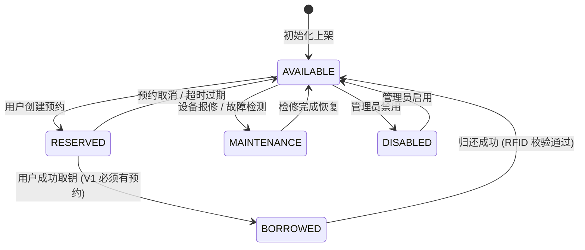
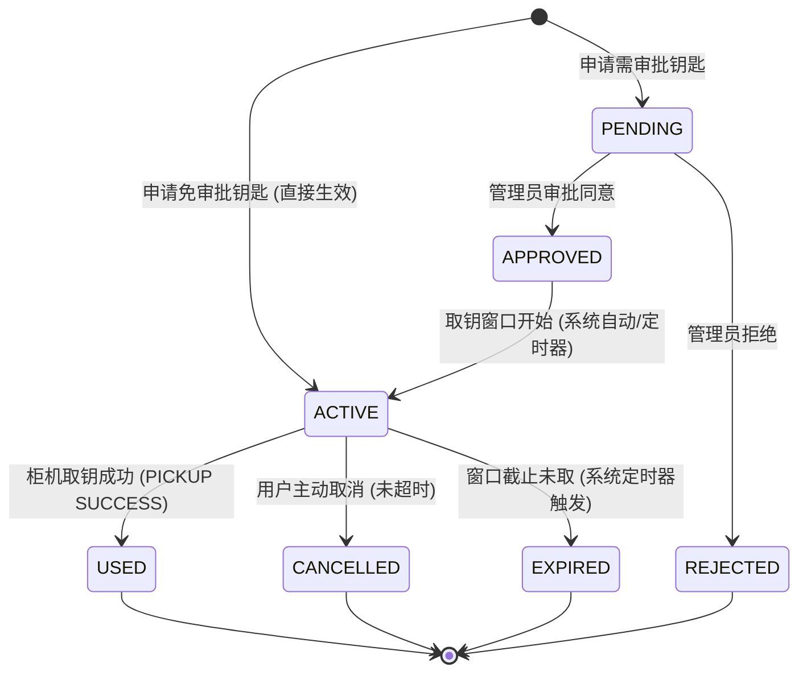
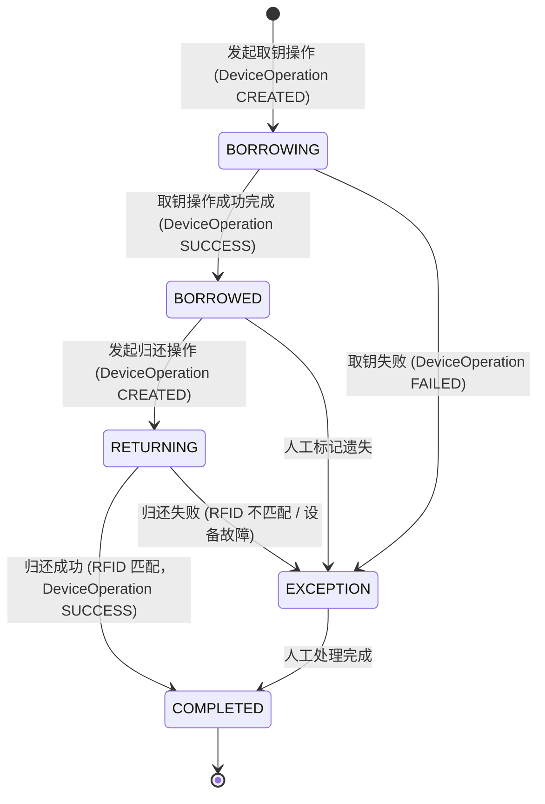
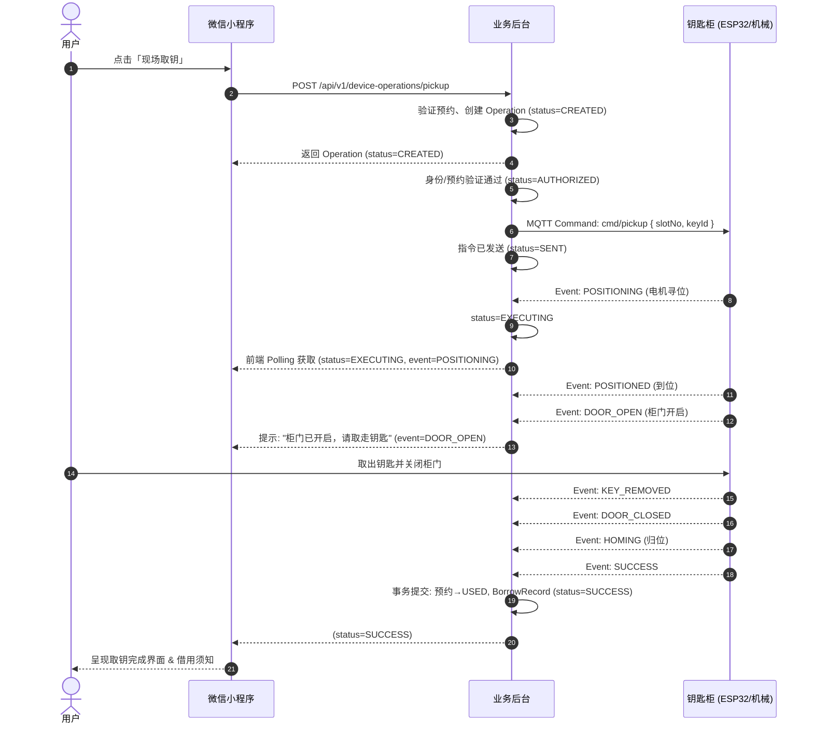
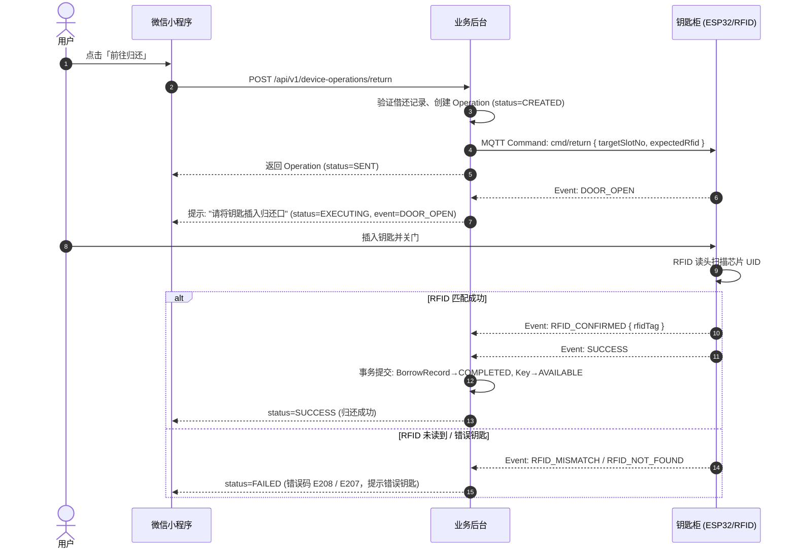

# 智能钥匙自助借还系统：核心状态机规范

> 文档版本：V1.0  
> 状态：正式冻结 (Frozen)  
> 适用范围：微信小程序、业务后台、柜控中间件 (RK3588/K230/ESP32)

---

## 1. 概述

本系统核心业务围绕四套核心状态机运转：
1. **钥匙状态机 (Key & Slot State Machine)**：管理钥匙物理在位与业务可用性；
2. **预约状态机 (Reservation State Machine)**：管理用户预约从申请、生效、使用到取消或过期的生命周期；
3. **借还记录状态机 (BorrowRecord State Machine)**：管理钥匙离柜借用、应还、逾期与归还结算的完整台账；
4. **设备操作状态机 (DeviceOperation State Machine)**：管理柜机硬件执行取钥与归还的异步时序与事件驱动流转。

---

## 2. 钥匙状态机 (Key & Slot State Machine)

钥匙状态由 **业务状态 (`status`)** 与 **物理槽位在位状态 (`presence`)** 协同定义。

### 2.1 状态枚举

**业务状态** (`Key.status`):
- `AVAILABLE` (可借/空闲)：钥匙在柜且无有效预约，任何有权限用户可即时借用或预约。
- `RESERVED` (已预约)：已有用户成功预约该钥匙，处于预约窗口期内，锁定给预约用户。
- `BORROWED` (已借出)：钥匙已被取出，当前处于借用履约期。
- `MAINTENANCE` (维护中)：钥匙或对应槽位硬件故障/维修，暂停对外服务。
- `DISABLED` (已停用)：钥匙被管理员下线禁用。

**注意**: `OVERDUE` (已逾期) 不作为 Key 的状态，而是从 BorrowRecord 派生计算得出。

物理槽位在位状态 (`KeySlot.presence`)：
- `PRESENT`：传感器/微动/RFID 检测到钥匙在槽位内。
- `ABSENT`：钥匙已从槽位移出。
- `UNKNOWN`：设备无法确认（检测中或传感器数据不确定）。
- `FAULT`：检测机构或槽位传感器异常。

### 2.2 状态转移矩阵



**V1 架构决策**: 暂不支持 `AVAILABLE → BORROWED` (现场无预约直借)，该功能规划至 V2 阶段。

### 2.3 状态流转规则与前置条件

| 当前状态 | 触发动作 | 目标状态 | 前置条件 / 校验规则 | 伴随物理槽位变更 |
| :--- | :--- | :--- | :--- | :--- |
| `AVAILABLE` | 创建预约 | `RESERVED` | 钥匙 `enabled=true` 且槽位 `presence=PRESENT` | 无变化 (`PRESENT`) |
| `RESERVED` | 取消/过期 | `AVAILABLE` | 预约主动取消或超出履约窗口 | 无变化 (`PRESENT`) |
| `RESERVED` | 执行取钥完成 | `BORROWED` | 预约合法、身份通过、机械手送出且门关闭 | `PRESENT` → `ABSENT` |
| `BORROWED` | 执行归还完成 | `AVAILABLE` | 钥匙放入、RFID UID 一致、门关闭 | `ABSENT` → `PRESENT` |
| 任意状态 | 硬件报障 | `MAINTENANCE`| 电机卡阻、槽位传感器持续失联 | 视硬件状态而定 |

---

## 3. 预约状态机 (Reservation State Machine)

### 3.1 状态枚举

- `PENDING` (待审批)：特殊钥匙需管理员审批通过后生效（默认普通钥匙直接生效）。
- `APPROVED` (已审批通过)：审批通过但取钥窗口尚未开始。
- `ACTIVE` (生效中/待取钥)：预约已生效且处于取钥时间窗口内，用户可前往钥匙柜取钥。
- `USED` (已履约/已使用)：用户已成功取出钥匙，预约单生命周期完结。
- `REJECTED` (已驳回)：管理员审批拒绝。
- `CANCELLED` (已取消)：用户在取钥前主动取消预约。
- `EXPIRED` (已超时过期)：超过取钥时间窗口截止时间未取钥，系统自动释放钥匙。

### 3.2 状态转移图



### 3.3 关键约束与防并发规则
1. **单一预约互斥**：同一用户在同一时间段内，对同一钥匙只能存在 1 笔处于 `ACTIVE` 或 `PENDING` 状态的预约。
2. **时间重叠互斥**：对于同一钥匙，任何两笔 `ACTIVE` 状态预约的借用时间段 `[borrowTime, returnTime]` 不得存在交集。
3. **过期定时释放**：预约的 `pickupWindowEnd` 到期后，后台定时任务将状态置为 `EXPIRED`，同时将钥匙业务状态从 `RESERVED` 恢复为 `AVAILABLE`。

---

## 4. 借还记录状态机 (BorrowRecord State Machine)

### 4.1 状态枚举

- `BORROWING` (取钥出柜中)：设备正在执行取钥操作。
- `BORROWED` (借用中)：钥匙已取出，处于借用期内。
- `RETURNING` (归还入柜中)：设备正在执行归还检测操作。
- `COMPLETED` (已完成)：归还成功，借还记录完结。
- `EXCEPTION` (异常状态)：钥匙遗失、还错钥匙、设备卡死等异常情况。

**重要设计决策**: `OVERDUE` (已逾期) 不作为 BorrowRecord 的主生命周期状态，而是通过派生逻辑计算：

```typescript
// 当前是否逾期
isOverdue = status === 'BORROWED' && now > expectedReturnAt

// 历史是否曾逾期
wasOverdue = status === 'COMPLETED' && overdueAt != null

// 前端显示归还结果
归还结果 = wasOverdue ? "逾期归还" : "按时归还"
```

### 4.2 状态转移图



### 4.3 逾期处理逻辑

**逾期判断时机**:
1. 前端实时计算：当用户查看借用记录时，前端比较 `now` 与 `expectedReturnAt`
2. 后台定时巡检：每隔一定时间扫描 `status=BORROWED` 且 `now > expectedReturnAt` 的记录，更新 `overdueAt` 字段（首次触发时记录）
3. 归还时结算：归还操作完成时，检查 `overdueAt` 是否存在，生成逾期时长统计

**字段约定**:
- `expectedReturnAt`: 应归还时间（必填）
- `overdueAt`: 首次逾期触发时间戳（逾期时记录，按时归还为 null）
- `returnedAt`: 实际归还时间戳（归还完成时记录）

**前端展示逻辑**:
```typescript
// 当前借用列表
if (record.status === 'BORROWED') {
  if (now > record.expectedReturnAt) {
    显示: "已逾期 X 小时" (高亮警示)
  } else {
    显示: "剩余 X 小时" (正常)
  }
}

// 历史记录
if (record.status === 'COMPLETED') {
  if (record.overdueAt) {
    显示: "逾期归还" + 逾期时长
  } else {
    显示: "按时归还"
  }
}
```

---

## 5. 设备操作状态机 (DeviceOperation State Machine)

设备操作管理小程序与柜机硬件交互的端到端异步事务（每次取钥或归还对应唯一的 `operationId`）。

### 5.1 状态枚举

- `CREATED` (已创建/初始化)：操作请求已接收并校验入库。
- `AUTHORIZED` (身份/预约验证通过)：已授权，准备向设备发送指令。
- `SENT` (已向设备发送控制指令)：MQTT 指令已发出，等待设备响应。
- `EXECUTING` (设备正在执行机械动作)：电机定位、开门、等待用户操作等。
- `SUCCESS` (操作成功完成)：硬件复位就绪，数据状态落盘。
- `FAILED` (操作失败中断)：由于硬件故障、RFID 校验不符等原因终止。
- `TIMEOUT` (操作超时)：用户长时间未操作或设备无响应。
- `CANCELLED` (操作被取消)：用户主动取消或管理员干预。

**设计说明**:
- `DeviceOperation.status`: 表示操作的**生命周期状态**
- `DeviceEvent.type`: 表示设备硬件当前执行的**具体步骤/事件** (如 `POSITIONING`, `DOOR_OPEN`, `KEY_REMOVED`, `RFID_CONFIRMED` 等)
- 前端通过 `status` 判断操作是否完成，通过 `events` 流展示实时进度

### 5.2 取钥操作 (Action = PICKUP) 详细流转



### 5.3 归还操作 (Action = RETURN) 详细流转



---

## 6. 异常状态与熔断恢复矩阵

| 异常事件 | 触发时机 | 错误码 | 系统与状态机应对策略 |
| :--- | :--- | :--- | :--- |
| `DEVICE_OFFLINE` | 发起操作时柜机离线 | `E201` | 拦截操作，Operation 置 `FAILED`，钥匙状态保持原样，提示用户使用其他柜机或联系管理员 |
| `DEVICE_BUSY` | 柜机正处理其他操作 | `E202` | 拒绝并发操作，返回重试等待提示 |
| `MOTOR_POSITION_FAILED` | 电机卡阻/寻位超时 | `E203` | 中止操作，Operation 置 `FAILED`，上报管理员故障告警，钥匙置 `MAINTENANCE` |
| `DOOR_OPEN_FAILED` | 电磁锁/舵机故障无法开门 | `E204` | 中止操作，安全复位，Operation 置 `FAILED` |
| `OPERATION_TIMEOUT` | 用户开门后长时间未取/未关门 (>60s) | `E210` | 柜体蜂鸣报警，强制复位关门，Operation 置 `FAILED`，恢复初始状态并记录日志 |
| `RFID_WRONG_KEY` | 归还了非对应钥匙 | `E208` | 语音/蜂鸣提示错误钥匙，柜门重新弹开退回，Operation 置 `FAILED`，借还单保持 `BORROWED` |
| 小程序意外退出/断网 | 操作执行中前端离开 | - | 客户端重启后由 `activeOperation` 查询后台接口，无缝恢复实时进度页面 |

---

## 7. 跨端一致性与事务保证

1. **唯一活跃操作约束**：同一把钥匙在同一时刻只能存在一个处于活跃状态 (`INIT`, `PREPARING`, `DOOR_OPENED`, `VERIFYING`) 的 `DeviceOperation`。
2. **幂等性保障**：操作请求均携带客户端生成的 `clientRequestId`，短时间内重复点击发起相同操作直接返回已有会话。
3. **最终一致性**：一切钥匙物理状态与借还业务状态以设备硬件上报的 `SUCCESS` 确认事件为唯一落盘基准。
