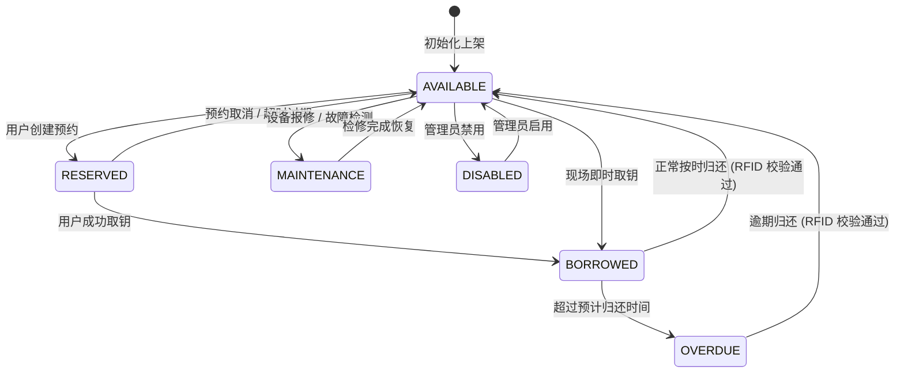
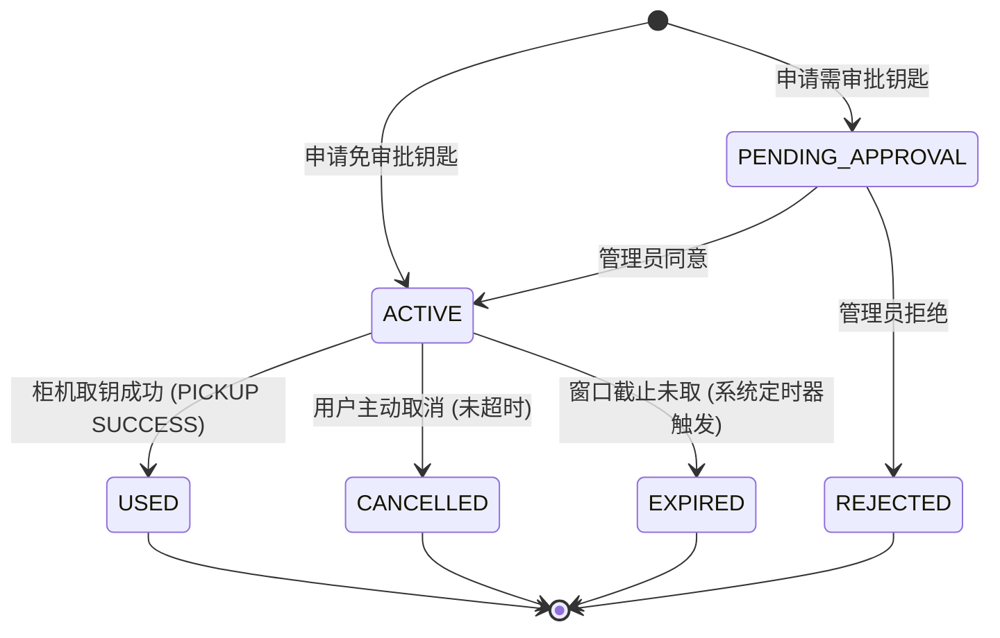
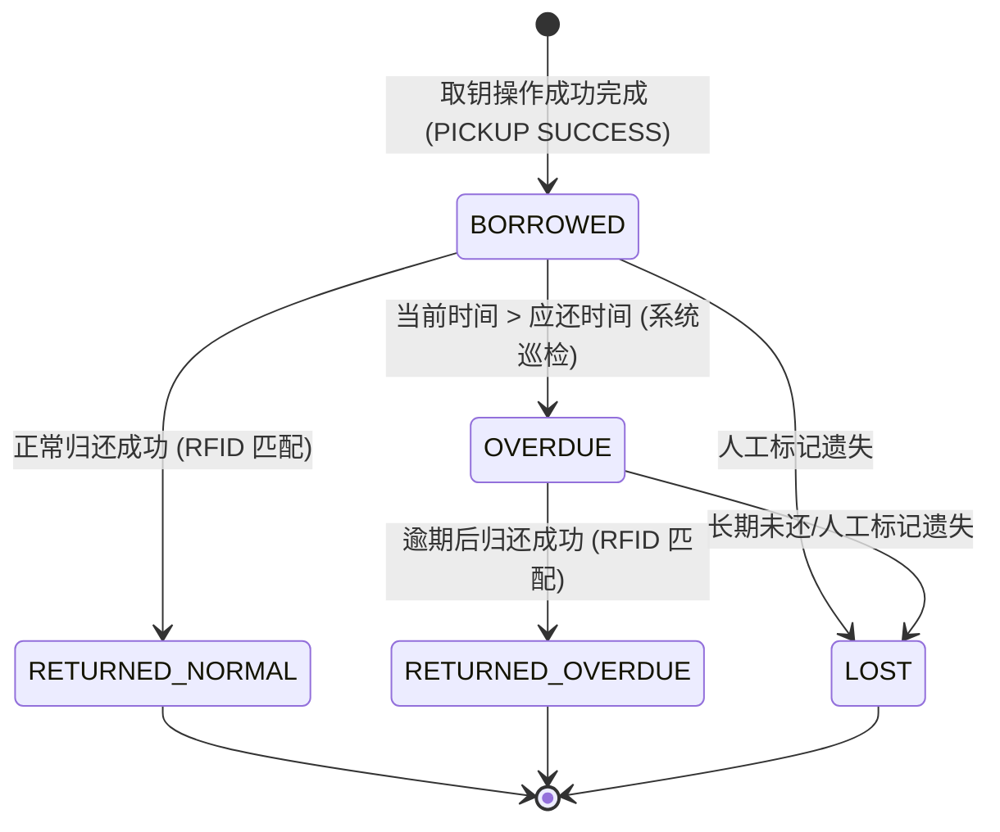
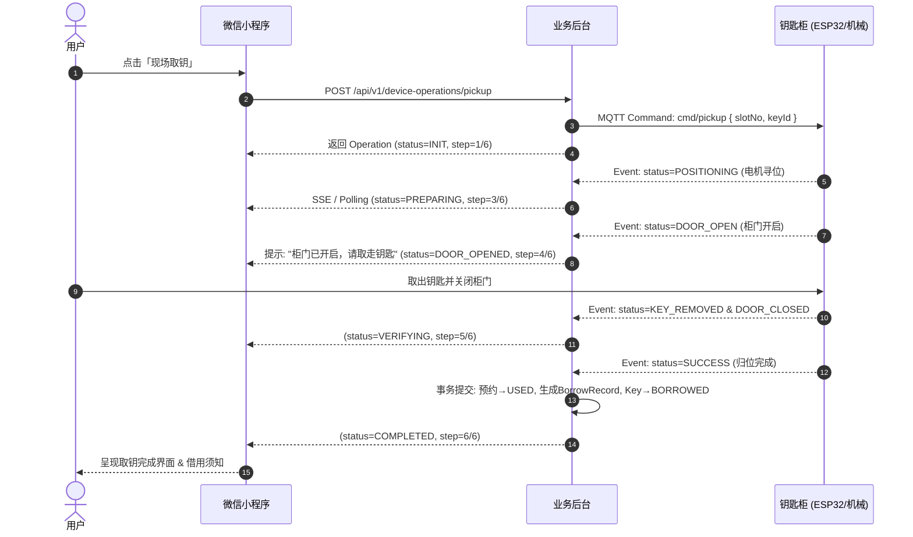
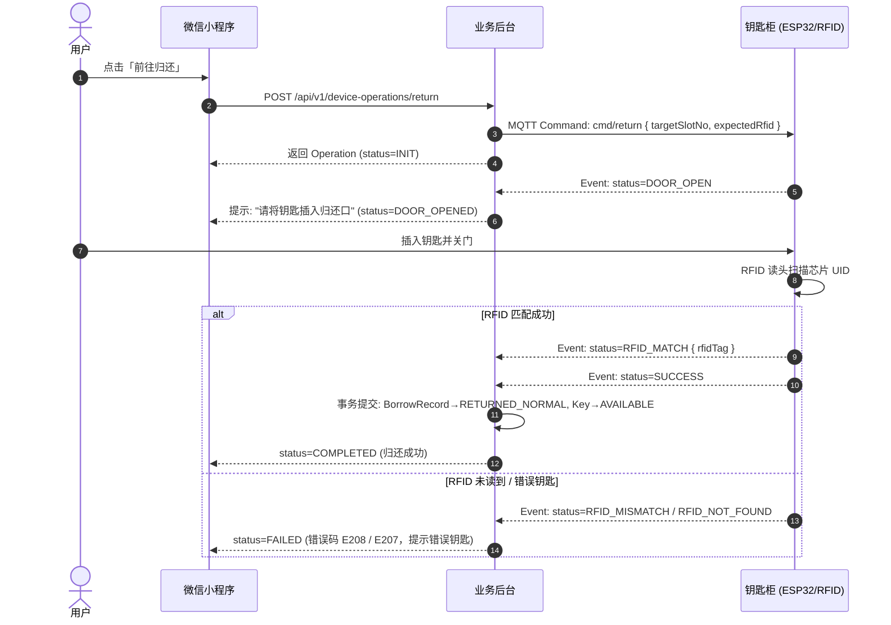

# 智能钥匙自助借还系统：核心状态机规范

> 文档版本：V1.0  
> 状态：正式冻结 (Frozen)  
> 适用范围：微信小程序、业务后台、柜控中间件 (RK3588/K230/ESP32)

---

## 1. 概述

本系统核心业务围绕四套核心状态机运转：
1. **钥匙状态机 (Key & Slot State Machine)**：管理钥匙物理在位与业务可用性；
2. **预约状态机 (Reservation State Machine)**：管理用户预约从申请、生效、使用到取消或过期的生命周期；
3. **借还记录状态机 (BorrowRecord State Machine)**：管理钥匙离柜借用、应还、逾期与归还结算的完整台账；
4. **设备操作状态机 (DeviceOperation State Machine)**：管理柜机硬件执行取钥与归还的异步时序与事件驱动流转。

---

## 2. 钥匙状态机 (Key & Slot State Machine)

钥匙状态由 **业务状态 (`status`)** 与 **物理槽位在位状态 (`presence`)** 协同定义。

### 2.1 状态枚举

- `AVAILABLE` (可借/空闲)：钥匙在柜且无有效预约，任何有权限用户可即时借用或预约。
- `RESERVED` (已预约)：已有用户成功预约该钥匙，处于预约窗口期内，锁定给预约用户。
- `BORROWED` (已借出)：钥匙已被取出，当前处于借用履约期。
- `OVERDUE` (已逾期)：钥匙已借出且超过预计归还时间未归还。
- `MAINTENANCE` (维护中)：钥匙或对应槽位硬件故障/维修，暂停对外服务。
- `DISABLED` (已停用)：钥匙被管理员下线禁用。

物理槽位在位状态 (`KeySlot.presence`)：
- `PRESENT`：传感器/微动/RFID 检测到钥匙在槽位内。
- `ABSENT`：钥匙已从槽位移出。

### 2.2 状态转移矩阵

### 2.3 状态流转规则与前置条件

| 当前状态 | 触发动作 | 目标状态 | 前置条件 / 校验规则 | 伴随物理槽位变更 |
| :--- | :--- | :--- | :--- | :--- |
| `AVAILABLE` | 创建预约 | `RESERVED` | 钥匙 `enabled=true` 且槽位 `presence=PRESENT` | 无变化 (`PRESENT`) |
| `RESERVED` | 取消/过期 | `AVAILABLE` | 预约主动取消或超出履约窗口 | 无变化 (`PRESENT`) |
| `RESERVED` | 执行取钥完成 | `BORROWED` | 预约合法、身份通过、机械手送出且门关闭 | `PRESENT` → `ABSENT` |
| `AVAILABLE` | 现场直接取钥 | `BORROWED` | 现场扫码/人脸验证成功、机械手送出且门关闭 | `PRESENT` → `ABSENT` |
| `BORROWED` | 超时巡检 | `OVERDUE` | 当前时间 > `expectedReturnAt` | 保持 `ABSENT` |
| `BORROWED` | 执行归还完成 | `AVAILABLE` | 钥匙放入、RFID UID 一致、门关闭 | `ABSENT` → `PRESENT` |
| `OVERDUE` | 执行逾期归还 | `AVAILABLE` | 钥匙放入、RFID UID 一致、结算逾期状态 | `ABSENT` → `PRESENT` |
| 任意状态 | 硬件报障 | `MAINTENANCE`| 电机卡阻、槽位传感器持续失联 | 视硬件状态而定 |

---

## 3. 预约状态机 (Reservation State Machine)

### 3.1 状态枚举

- `PENDING_APPROVAL` (待审批)：特殊钥匙需管理员审批通过后生效（默认普通钥匙直接生效）。
- `ACTIVE` (生效中/待取钥)：预约已生效，用户可在预约窗口内前往钥匙柜取钥。
- `USED` (已履约/已使用)：用户已成功取出钥匙，预约单生命周期完结。
- `CANCELLED` (已取消)：用户在取钥前主动取消预约。
- `EXPIRED` (已超时过期)：超过取钥时间窗口截止时间未取钥，系统自动释放钥匙。
- `REJECTED` (已驳回)：管理员审批拒绝。

### 3.2 状态转移图

### 3.3 关键约束与防并发规则
1. **单一预约互斥**：同一用户在同一时间段内，对同一钥匙只能存在 1 笔处于 `ACTIVE` 或 `PENDING_APPROVAL` 状态的预约。
2. **时间重叠互斥**：对于同一钥匙，任何两笔 `ACTIVE` 状态预约的借用时间段 `[borrowTime, returnTime]` 不得存在交集。
3. **过期定时释放**：预约的 `pickupWindowEnd` 到期后，后台定时任务将状态置为 `EXPIRED`，同时将钥匙业务状态从 `RESERVED` 恢复为 `AVAILABLE`。

---

## 4. 借还记录状态机 (BorrowRecord State Machine)

### 4.1 状态枚举

- `BORROWED` (借用中)：钥匙已取出，处于借用期内。
- `RETURNED_NORMAL` (正常归还/已完成)：在应还时间之前归还且 RFID 芯片验证通过。
- `OVERDUE` (已逾期)：当前时间已超过应还时间，借还单标记逾期。
- `RETURNED_OVERDUE` (逾期归还)：逾期后归还成功，记录实际逾期时长。
- `LOST` (钥匙遗失/异常结算)：用户报告遗失或管理员人工干预结算。

### 4.2 状态转移图

---

## 5. 设备操作状态机 (DeviceOperation State Machine)

设备操作管理小程序与柜机硬件交互的端到端异步事务（每次取钥或归还对应唯一的 `operationId`）。

### 5.1 状态枚举

- `INIT` (已创建/初始化)：操作请求已接收并校验入库。
- `PREPARING` (准备中/定位中)：正在建立硬件会话，电机移动定位槽位。
- `DOOR_OPENED` (柜门开启)：柜门/取还口已打开，等待用户操作。
- `VERIFYING` (验证中/检测中)：用户放入钥匙后，RFID 正在扫描校验。
- `COMPLETED` (操作成功完成)：硬件复位就绪，数据状态落盘。
- `FAILED` (操作失败中断)：由于硬件故障、超时、RFID 校验不符等原因终止。

### 5.2 取钥操作 (Action = PICKUP) 详细流转

### 5.3 归还操作 (Action = RETURN) 详细流转

---

## 6. 异常状态与熔断恢复矩阵

| 异常事件 | 触发时机 | 错误码 | 系统与状态机应对策略 |
| :--- | :--- | :--- | :--- |
| `DEVICE_OFFLINE` | 发起操作时柜机离线 | `E201` | 拦截操作，Operation 置 `FAILED`，钥匙状态保持原样，提示用户使用其他柜机或联系管理员 |
| `DEVICE_BUSY` | 柜机正处理其他操作 | `E202` | 拒绝并发操作，返回重试等待提示 |
| `MOTOR_POSITION_FAILED` | 电机卡阻/寻位超时 | `E203` | 中止操作，Operation 置 `FAILED`，上报管理员故障告警，钥匙置 `MAINTENANCE` |
| `DOOR_OPEN_FAILED` | 电磁锁/舵机故障无法开门 | `E204` | 中止操作，安全复位，Operation 置 `FAILED` |
| `OPERATION_TIMEOUT` | 用户开门后长时间未取/未关门 (>60s) | `E210` | 柜体蜂鸣报警，强制复位关门，Operation 置 `FAILED`，恢复初始状态并记录日志 |
| `RFID_WRONG_KEY` | 归还了非对应钥匙 | `E208` | 语音/蜂鸣提示错误钥匙，柜门重新弹开退回，Operation 置 `FAILED`，借还单保持 `BORROWED` |
| 小程序意外退出/断网 | 操作执行中前端离开 | - | 客户端重启后由 `activeOperation` 查询后台接口，无缝恢复实时进度页面 |

---

## 7. 跨端一致性与事务保证

1. **唯一活跃操作约束**：同一把钥匙在同一时刻只能存在一个处于活跃状态 (`INIT`, `PREPARING`, `DOOR_OPENED`, `VERIFYING`) 的 `DeviceOperation`。
2. **幂等性保障**：操作请求均携带客户端生成的 `clientRequestId`，短时间内重复点击发起相同操作直接返回已有会话。
3. **最终一致性**：一切钥匙物理状态与借还业务状态以设备硬件上报的 `SUCCESS` 确认事件为唯一落盘基准。
